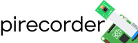

# Summary
*Begin your paper with a summary of the high-level functionality of your software for a non-specialist reader. Avoid jargon in this section.*

*some sentences that explain the software functionality and domain of use to a non-specialist reader.*

*Explain the research applications of the software. what problems the software is designed to solve and who the target audience is.*

*A clear Statement of Need that illustrates the research purpose of the software.*

*describe how this software compares to other commonly-used packages*

*Mention (if applicable) a representative set of past or ongoing research projects using the software and recent scholarly publications enabled by it.*

Key features

* Controlled recording using custom, easy-to-edit configuration files
* Record single images and videos, timelapses, and sequences of videos
* Configure camera settings interactively via a live camera stream
* Dynamically draw the region of interest for your recordings
* Automatic naming of files and folders with relevant and custom labels
* Easy scheduling and automating recordings in the future
* Direct control of all modules via simple terminal commands
* Convert (folders of) images and videos with resize, monitor, and label options
* Dedicated documentation website with detailed guides and tutorials
* Jupyter notebook tutorial files

The Raspberry Pi is a single-board, low-cost micro-computer built on open-source principles. This low-cost computer, developed by the Raspberry Pi Foundation, a UK charity that aims to educate people in coding and computing, is currently the most popular micro-computer available. The Raspberry Pi is also increasingly taken up by the scientific community [@Fletcher2019] and used as a central component in research projects across a range of fields. One of the foremost uses of the Raspberry Pi is image and video recording. 

Read barcodes on animals. [@Alarcon-Nieto2018] used multiple Raspberry Pi's as part of a long-term, automated monitoring system of birds housed in outdoor aviaries and were able to track individuals based small barcoded backpacks.

Builds heavily on the picamera package [@Jones2018], and uses OpenCV [@Bradski2000] for user-interfaces to dynamically control the raspberry pi camera settings.

For example @Aidukas2019 captured raw 10-bit Bayer images using the picamera package for sub-micron resolution microscopy.

Here is a figure:
\autoref{fig:example}

The package consists of a main PiRecorder module to run recordings, stream and camconfig modules for help setting up, calibrating, and configuring the camera, a schedule module for scheduling future recordings, and a convert module for the easy converting of (folders of) recorded images and videos.

A core component of pirecorder is that it uses configuration files and timeplans that can be easily called, modified, and stored by the user, with automatic naming of files and folders. pirecorder also works directly from the terminal without the need to code in Python.

pirecorder is both Python 2.7 and 3 compatible. It builds strongly on the picamera package and opencv for some of its core functionality.

The main functionality of pirecorder is the PiRecorder module. This class initiates a PiRecorder instance that sets up the raspberry pi to record either A) a single image, b) a sequence of images, C) a single video, or D) a session of video recordings. When PiRecorder is run for the first time, it creates a “pirecorder” setup directory in the user’s home folder to store all relevant setup files. This includes the default configuration file (pirecorder.conf) with all recording and camera settings as well as a log file (pirecorder.log) that will store all terminal output when PiRecorder is used to help keep a history log of your recordings.

PiRecorder is set up in such a way that it is very easy to set and save custom recording and camera settings that are then automatically used for future recordings without further user input. Multiple configuration files can be created and called for specific recording settings and the configuration file(s) can be easily edited with any text editor as well as updated from the command line with the settings function.

A large number of custom recording parameters can be set, divided into 1) general user recording parameters, 2) camera settings, 3) video recording settings, 4) image recording settings, and 5) custom settings.

There are four recording modes, which can be set with the rectype parameter:
- img: Records a single image with the custom settings.
- imgseq: Creates a controlled sequence of images (i.e. timelapse) based on A) the set duration (imgtime) and B) the set total number of images to be recorded (imgnr) and the provided time delay between images (imgwait).
- vid: Records a single video. Specific settings that can be set for this mode are vidfps (the framerate of the video), vidduration (the duration of the video), and viddelay (extra recording time in seconds that will be added to vidduration).
- vidseq: Starts a series of standardized videos using the custom settings whereby, after each recording has ended, the user is asked if a new recording should be started or the program should exit.

The configuration file can be set with the configfile parameter when initiating the PiRecorder instance, which defaults to “pirecorder.conf”. For example, to work with a special config file for infrared recordings, you can run. The configuration files can be simply changed manually with any text editor or with your favorite terminal editor (e.g. nano pirecorder/pirecorder.conf). You can also easily update the configuration via the settings function and only add the parameters you want to change. 

It is possible to set a large number of camera settings with pirecorder: rotation, gains, brightness, contrast, saturation, iso, sharpness, compensation, and shutterspeed. 

pirecorder also comes with a very handy interactive tool (camconfig) that enables you to set the camera settings dynamically. camconfig opens a live video stream and a separate window with a trackbar for each of the camera settings. You can slide your parameters of interest between the possible values and see live how the resulting recording will look like. To run camconfig and store the values automatically in your configuration file, use the function linked to your PiRecorder instance:

rec.camconfig()
You can exit the stream without saving with the esc-key and with saving with the s-key.

An important setting is the automatic mode. By default this is set to True such that it automatically gets the optimal shutterspeed and white balance (blue and red gains), which is visible by the respective trackbars sliding automatically to their optimal values. When you are relatively happy with these values it is a good time to use the non-automatic mode as then you are able to further tweak these values to your wishes.

camconfig will use the framerate as provided in the configuration file, but you can also dynamically update the framerate while the video stream is open, which in turn will influence the range of shutterspeeds possible (see above). It is also possible to use camconfig stand alone without a PiRecorder instance. Simply import pirecorder and run the function.

Files are automatically stored in the configured directory (recdir), by default a directory called recordings in the pirecorder directory, and named according to the provided label, the computer name, the date and time, and potentially the session number or image sequence number.

In addition to the main recording module, pirecorder contains a number of modules to facilitate setting-up and configuring the raspberry pi camera, schedule future recordings, and convert recorded media:
- stream: Opens a live video stream with user interface to calibrate the raspberry pi camera in terms of its position, focus, and region of interest (roi). For more detail, see the calibrate camera page.

Pirecorder comes with a stream module that displays an interactive live video stream on the desktop to help position the raspberry pi camera and objects in the camera view, draw a region of interest to be used for recordings, and zoom in on part of the video. It records the clicks and movements of the mouse and responds to the following keypresses.

It is also possible to overlay an image on the video stream. This can be highly beneficial to help position the camera exactly like in a previous recording or arrange objects in the field of view of the camera exactly like before, such as a custom maze for behavioural experiments.

The stream function comes with the option to display a simple diagonal white cross, which can help to accurately position the camera or objects of interest below the camera. 

Clicking and drawing the mouse will draw a rectangular area. This can be used directly to store the coordinates of the region of interest that should be used for recordings, i.e. to only record the region inside the rectangular area.

Simply draw and redraw the rectangular area until you are happy and press the s-key. Now the coordinates of the region of interest will be displayed and, if running the stream functionality from a PiRecorder instance, stored automatically in the configuration file (e.g. rec.config.cus.roi). If you stored the region of interest accidentally or want to remove the drawn rectangle simple enter the e-key. To exit press the esc-key.

Show a zoomed-in region at full resolution
Besides drawing the rectangular area for creating a region of interest for recordings, it can also be used to zoom-in on part of the video at the maximum image resolution. This can be very helpful to help you improve the focus of the raspberry pi camera. To do so, simply draw a rectangular area around the region you want to zoom-in to with the mouse and when satisfied press the z-key. Now a second window will open that will show the zoomed-in region of the video as an image.

As this is at the maximum image resolution, which is a lot higher than the maximum video resolution, it will only show a static image, but thus with much more detail than the video stream. You can refresh the image by pressing the n-key. To exit, press the esc-key.

- camconfig: Opens a live video stream with user interface to dynamically, both manually and automatically, set the camera settings, including camera rotation, shutterspeed, whitebalance, iso, exposure compensation, brightness, contrast, saturation, and sharpness. For more detail, see the configure camera settings page
- schedule: Automatically start image and video recording in the future according to custom recording schedules. For more detail, see the schedule recordings page.

Besides starting recordings directly, it is possible to schedule recordings to start recordings (repeatedly) in the future. For this there is the schedule function, which creates unique recording jobs (jobname) with specific timeplans. Easily set, test timeplans, and show, enable, disable, and delete jobs.

-  convert: Convert (folders of) images or videos to videos with the option to resize, add timestamps on each frame, and monitor folders for automatic conversion. For more detail, see the convert media page.

The convert module of the pirecorder package facilitates the converting of recorded media, both of individual images and videos as well as directories of videos, with the ability to resize, add timestamps on each frame, and monitor folders for automatic conversion. It can be set to optimally use the number of computer cores available, can be run directly from the command line, and works across different operating systems.

[detailed documentation](https://jollejolles.github.io/pirecorder/), pirecorder includes a set of Jupyter Notebooks with examples. For detailed documentation and tutorials about pirecorder and all its functionalities, see the dedicated website jollejolles.github.io/pirecorder/.

Used successfully for the controlled and repeated video recording of individually housed fish over multi-week period [@Jolles2019] as well as groups of fish [@Jolles2018], which enabled the subsequent tracking of individual identities. Also more recently we filmed 24 tanks of fish every day for 4+ months from dawn till dusk.

# Acknowledgements
This research was made possible by a postdoctoral fellowship from the the Alexander von Humboldt-Stiftung, a postdoctoral fellowship from the Zukunfstkolleg, Institute for Advanced Study, and a research grant from the Dr. J.L. Dobberke Foundation.

# References
