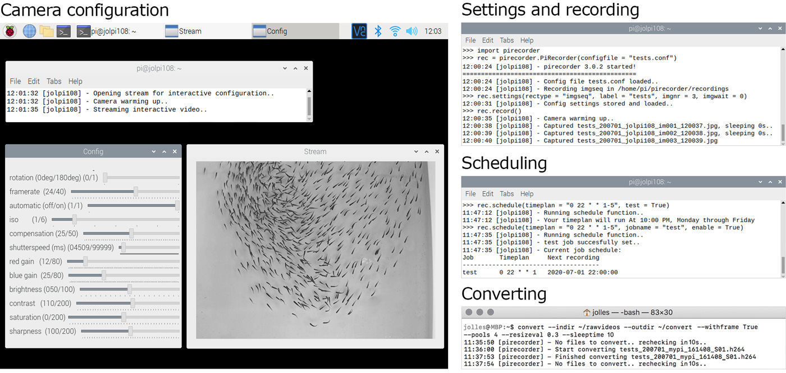

# Summary
A fundamental component of empirical research is the acquisition of accurate, consistent, and often significant amounts of data. The raspberry pi is small, single-board computer that facilitates controlled and automated data collection by bringing together open-source principles with sensor, camera, and controller interfaces, and highly customisable programming capabilities. Owing to its low cost, ease of use, and high flexibility, the raspberry pi has also been increasingly taken up by the scientific community [@Fletcher2019], with one of its foremost uses being the collection of high quality image data. For example, the raspberry pi has been used for sub-micron resolution microscopy [@Aidukas2019], deep sea video recordings [@Phillips2019],  motion-triggered camera trapping [@Nazir2017; @Prinz2016], high-throughput behavioural assessments [@Geissmann2017; @Jolles2019; @Todd2017], long-term tracking of animals [@Singh2019], and the automated monitoring of animal groups [@Alarcon-Nieto2018; @Jolles2018].

Researchers can use the native software that comes with the raspberry pi to take still photographs and videos directly from the command line (`raspistill` and `raspivid`) or control the camera module using Python with the `picamera` Python package [@Jones2017]. Also specific solutions exist for the monitoring of camera signals and the detection of motion ([Motion](https://motion-project.github.io)), home cage observations [@Singh2019], and behavioural profiling with the raspberry pi [@Geissmann2017]. However, a flexible, complete solution for controlled and automated image and video recording was still lacking.

`pirecorder` is a Python package build on the picamera [@Jones2017] and OpenCV [@Bradski2000] libraries that provides a simple-to-use solution for the collection of consistent image and video data with the raspberry pi. It consists of a number of interconnected modules to facilitate all aspects of media recording, from setting-up, calibrating and configuring the camera, recording of images and videos, time-lapses, and standardised sequences of videos with automatic file-naming, easy scheduling of future recordings, and converting of recorded images and videos with resize, timestamp, and monitoring options. All modules also work directly from the command line, making it very straightforward to configure, initiate, schedule, and convert recordings.

A key functionality of `pirecorder` is that it works with configuration files to store a wide range of camera and recording settings that are then used automatically for future recordings without requiring further user input. Multiple configuration files can be used, which can be edited directly, such as to set the video duration, quality, or number of images, as well as via an interactive video stream, such as to draw the region of interest, set the desired white balance, or get the optimal camera shutter speed. Recordings can be easily initiated remotely, such as via an SSH connection, or scheduled to automatically start and stop at specific times in the future. By its use of configuration files and the automatic naming of files, `pirecorder` also makes it easy to start controlled recordings on multiple raspberry pi's simultaneously, such as with [csshX](https://github.com/brockgr/csshx) which sends the same command to multiple computers at once.  

`pirecorder` has already been used successfully in a number of studies, such as to facilitate the high-throughput recording of large numbers of individuals and shoals of fish [@Jolles2017; @Jolles2018; @Jolles2019] and more recently, the autonomous long-term recording of fish each day, every day, for the first four-month of their life. `pirecorder` comes with a dedicated website with detailed documentation and tutorials ([jollejolles.github.io/pirecorder](https://jollejolles.github.io/pirecorder/)) as well as a set of annotated [Jupyter Notebooks](https://github.com/JolleJolles/pirecorder/tree/master/notebooks). By facilitating and streamlining controlled and automated image and video recordings, I ultimately hope `pirecorder` will help scientists simplify and improve the collection of high quality data and thereby enhance their research.

# Acknowledgements
This work was made possible by a postdoctoral fellowship from the Alexander von Humboldt-Stiftung, a postdoctoral fellowship from the Zukunfstkolleg, Institute for Advanced Study, and a research grant from the Dr. J.L. Dobberke Foundation.

# References
